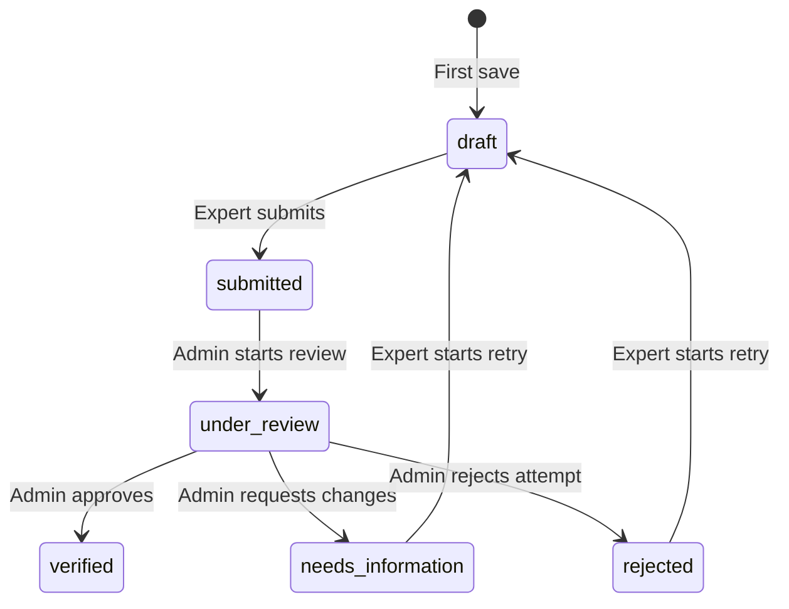

# KYC Flow

The detailed application status is authoritative for the expert and administrator interfaces. `experts.kyc_status` is only the coarse authentication-facing approval state.

## Requesting Additional Information

1. The administrator starts review and inspects the application and private documents.
2. The administrator enters a required summary and at least one structured change item.
3. Each item identifies a section, an optional document, and a concrete instruction.
4. The backend locks the application, validates the transition and document ownership, stores the feedback, updates the coarse expert state, and records status history in one transaction.
5. After commit, an email notification is queued. Sensitive feedback stays inside the authenticated application.
6. The expert dashboard refreshes locked requests periodically and on focus, then shows an action-required banner.
7. The first expert save creates a linked draft attempt. The reviewed attempt remains immutable, and its feedback remains visible through `reviewFeedback`.
8. The expert updates data or documents and resubmits. The new attempt returns to `submitted` and the active feedback banner closes.

## State Responsibilities

| State | Expert | Administrator |
|---|---|---|
| `draft` | Edit, upload, delete, submit | No access |
| `submitted` | Read only | View and start review |
| `under_review` | Read only | Review documents and decide |
| `needs_information` | Read feedback and begin retry | Read prior decision |
| `rejected` | Read reason and begin retry | Read prior decision |
| `verified` | Read approved application | Read final decision |

The expert never sends an expert ID, application status, decision data, or administrator-owned fields.
